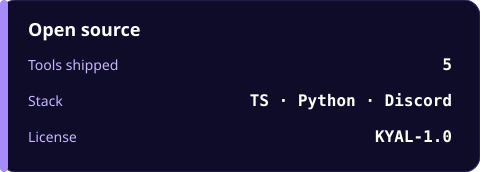
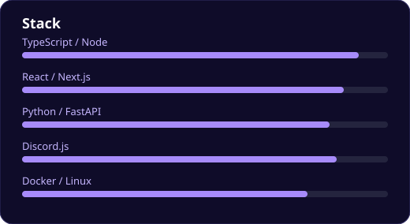
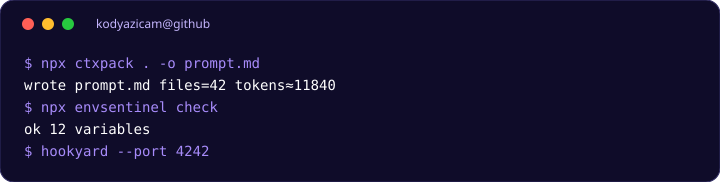

<p align="center">
  
</p>

<p align="center">
  <strong>Generate GitHub README SVGs on your machine.</strong><br/>
  Banners, stat cards, skill bars, terminals, badges. No third-party render service.
</p>

<p align="center">
  
  
  
</p>

---

capsule-render, github-readme-stats, and typing SVGs look great until the CDN is down or the theme breaks. **svgforge** writes the same kind of cards as files you commit. GitHub serves them from your repo. No camo outage, no rate limit, no query-string theme API.

```bash
npx svgforge banner --title ctxpack --subtitle "Pack a codebase into LLM context" -o assets/banner.svg
```

<p align="center">
  
  
</p>

<p align="center">
  
</p>

## Table of contents

- [Requirements](#requirements)
- [Install](#install)
- [Quick start](#quick-start)
- [Card types](#card-types)
- [Themes](#themes)
- [CLI](#cli)
- [Manifest](#manifest)
- [Library](#library)
- [GitHub README usage](#github-readme-usage)
- [Escaping and limits](#escaping-and-limits)
- [Troubleshooting](#troubleshooting)
- [FAQ](#faq)
- [License](#license--kyal-10)

## Requirements

- Node.js **20+**
- No canvas, no browser, no network

## Install

```bash
npx svgforge banner --title hello -o banner.svg
npm install -g svgforge

git clone https://github.com/KodYazicam/svgforge.git
cd svgforge
npm install
npm test
npm run build
node dist/cli.js render examples/demo.json -o examples/
```

## Quick start

```bash
svgforge banner --title hookyard --subtitle "Catch webhooks" --theme tokyonight -o banner.svg
svgforge stats --item Stars=12 --item Forks=3 -o stats.svg
svgforge skills --item TypeScript=90 --item Python=80 -o skills.svg
svgforge terminal --line "$ hookyard --port 4242" --line "listening" -o term.svg
svgforge badge --label license --value KYAL-1.0 -o badge.svg
svgforge render examples/demo.json -o examples/
svgforge themes
```

Without `-o` / `--out`, SVG goes to stdout (redirect with `> file.svg`).

## Card types

| Type | Flags | Use |
| --- | --- | --- |
| `banner` | `--title` `--subtitle` | Hero header |
| `stats` | `--title` `--item Label=Value` (repeat) | Label / value rows |
| `skills` | `--title` `--item Name=0-100` (repeat) | Percentage bars (clamped 0–100; invalid → 0) |
| `terminal` | `--title` `--line text` (repeat) | Fake shell; lines starting with `$` or `>` use the accent color |
| `badge` | `--label` `--value` | Tiny pill |

All commands accept `--theme`.

## Themes

`midnight` (default) · `tokyonight` · `dracula` · `nord` · `github`

```bash
svgforge themes
```

## CLI

```text
svgforge banner|stats|skills|terminal|badge [flags] [-o file.svg] [--theme name]
svgforge render manifest.json -o ./outdir
svgforge themes
svgforge --help
svgforge --version
```

`render` writes one file per card. Nested `out` paths are created (`assets/hero/banner.svg`).

## Manifest

`examples/demo.json`:

```json
{
  "theme": "midnight",
  "cards": [
    {
      "type": "banner",
      "title": "ctxpack",
      "subtitle": "LLM context packer",
      "out": "banner.svg"
    },
    {
      "type": "stats",
      "title": "Open source",
      "items": [
        { "label": "Tools shipped", "value": "5" },
        { "label": "License", "value": "KYAL-1.0" }
      ],
      "out": "stats.svg"
    },
    {
      "type": "skills",
      "items": [{ "name": "TypeScript", "level": 90 }],
      "out": "skills.svg"
    }
  ]
}
```

Per-card `theme` overrides the manifest default. If `out` is omitted, files are `banner-1.svg`, `stats-2.svg`, …

## Library

```ts
import { banner, skills, renderManifest, THEMES } from "svgforge";

const svg = banner({
  title: "envsentinel",
  subtitle: "Lint your .env",
  theme: "nord",
});

const files = renderManifest({
  theme: "midnight",
  cards: [{ type: "badge", label: "license", value: "KYAL-1.0", out: "badge.svg" }],
});
```

Exports: `banner`, `stats`, `skills`, `terminal`, `badge`, `renderCard`, `renderManifest`, `THEMES`, `escapeXml`.

## GitHub README usage

Commit the SVG, then:

```markdown
<p align="center">
  
</p>
```

Relative paths work on GitHub, npm, and clones. Do not hotlink a render API if you want the image to survive that API.

Dark GitHub UI: use `midnight`, `tokyonight`, `dracula`, or `github`. Light UI: `nord` is the least dark.

## Escaping and limits

All user strings go through `escapeXml` (`& < > " '`). Titles like `A&B <C>` will not break the SVG.

Skill `level` is clamped to 0–100. Non-numeric CLI values become 0.

Fonts are generic (`ui-monospace`, `ui-sans-serif`) so GitHub’s renderer does not need webfonts.

## Troubleshooting

| Symptom | Fix |
| --- | --- |
| Blank / tiny image on GitHub | Wait for cache; hard-refresh. Path must be committed, not gitignored |
| Theme ignored | Name must be one of `svgforge themes`. Unknown names fall back to `midnight` |
| `--item` parsed wrong | Use `Label=Value` with no spaces around `=`, or quote: `--item "Stars=12"` |
| `render` missing files | Pass `-o` directory; check `out` filenames in the JSON |
| XML entity in title | Already escaped. If you double-escape you will see `&amp;amp;` |

## FAQ

**Can it fetch GitHub stats live?** No. That is the point. Pass numbers you control.

**Animated banners?** Not in v1. Static SVG only.

**Can I edit the SVG in Figma?** Yes. It is plain SVG.

## License — KYAL-1.0

Free to use and modify. **Attribution is mandatory.**

```
Author : Batuhan (KodYazicam)
Project: svgforge
Source : https://github.com/KodYazicam/svgforge
```

See [LICENSE](./LICENSE).

<p align="center"><sub>Built by <a href="https://github.com/KodYazicam">KodYazicam</a></sub></p>
